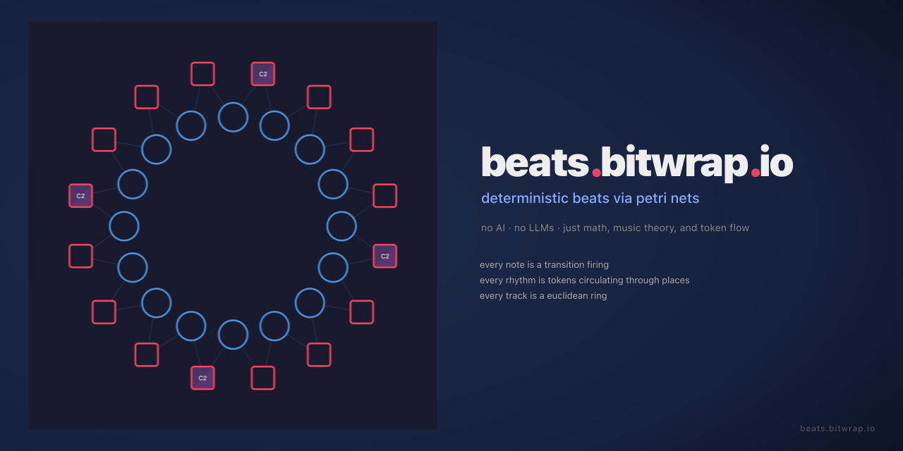

[](https://beats.bitwrap.io)

# beats-btw

A deterministic beat generator powered by Petri nets. No AI, no LLMs, no neural networks — just math, music theory, and token flow.

**Live at [beats.bitwrap.io](https://beats.bitwrap.io)**

## How It Works

Petri nets are mathematical models where **tokens** circulate through **places** and **transitions** fire when conditions are met. beats-btw uses this to generate music:

- **Drum patterns** are Euclidean rhythms encoded as token rings — the [Bjorklund algorithm](https://en.wikipedia.org/wiki/Euclidean_rhythm) distributes K hits across N steps, then a single token circulates the ring, triggering MIDI notes at hit positions
- **Melodies** use Markov-chain composition with music theory constraints — chord-tone targeting on strong beats, stepwise motion on weak beats, density-controlled rests
- **Bass lines** walk chromatically between chord roots using approach notes
- **Song structure** is controlled by linear Petri nets that mute/unmute tracks at section boundaries

Everything is **100% deterministic** given the same seed. Same genre + same seed = same track, every time. The generation uses seeded PRNGs, Euclidean geometry, music theory rules, and graph traversal — no machine learning, no sampling, no probabilistic models beyond explicit Markov chains with hand-tuned transition weights.

## Architecture

```
Browser Main Thread                    Web Worker
──────────────────                    ──────────────
petri-note.js (UI)  ◄─ postMessage ─► sequencer-worker.js
tone-engine.js (audio)                 ├── pflow.js (Petri net engine)
                                       └── generator/ (beat generation)
```

The sequencer runs in a **Web Worker** so timing stays accurate even when the tab is backgrounded. The worker posts `transition-fired` messages to the main thread, which plays sounds via Tone.js. Zero backend involvement during playback.

## Genres

19 genre presets with distinct scales, chord progressions, drum patterns, and instrument palettes:

`techno` `house` `jazz` `ambient` `dnb` `edm` `speedcore` `dubstep` `country` `blues` `synthwave` `trance` `lofi` `reggae` `funk` `bossa` `trap` `garage` `metal`

Each genre defines BPM, scale type, root note, Euclidean drum parameters, melody density, swing, humanize, and variety features (ghost notes, walking bass, call/response, modal interchange, tension curves).

## Features

- **Euclidean rhythms** — mathematically optimal hit distribution for drums
- **Markov melodies** — chord-aware note selection with beat-strength rules
- **Walking bass** — chromatic approach notes between chord roots
- **Ghost notes** — low-velocity fills between hihat hits for groove
- **Song structure** — intro/verse/chorus/drop/bridge/outro with phrase variants (A/B/C tension levels)
- **19 genre presets** with per-genre music theory (chord progressions, drum styles, phrase patterns)
- **Modal interchange** — borrows chords from parallel key for harmonic color
- **Polyrhythm** — odd-length hihat loops (e.g., 6-over-4)
- **Call and response** — 32-step melodies with mirrored answering phrases
- **Dual-ring melodies** — interlocking theme/variation rings with crossover transitions
- **Per-channel mixer** — volume, pan, HP/LP filters, resonance, decay. Drum voices (kick/snare/hihat) live on independent channels so each gets its own strip, presets, and FX routing.
- **Dynamic ring size / hits** — resize any track's Euclidean or melodic ring live (2–32 steps) while playing; the subnet rebuilds and swaps in at the next bar boundary
- **Tone presets** — save a track's full mixer panel (vol, pan, filters, decay) as a named preset per channel; apply to any track in that family (★ button)
- **Master FX** — reverb, delay, distortion, phaser, bit crusher, filters
- **Live-performance macros** — one-tap tricks organized by group, each pulsing the UI element it touches and restoring it on release:
  - *Mute*: Drop, Breakdown, Solo Drums, Cut, Beat Repeat, Double Drop
  - *FX*: Sweep LP / HP, Reverb Wash, Delay Throw, Riser, Bit Crush, Phaser Drone, Cathedral, Dub Delay, Res Ping
  - *Pitch*: Octave Up / Down, Pitch Bend, Vinyl Brake
  - *Tempo*: Half Time, Tape Stop
  - *Pan* (per-channel, non-drum targets): Ping-Pong, Hard Left / Right, Auto-Pan, Mono
  - *Shape*: Tighten (per-channel decay pull)
- **Beats (stinger fire pads)** — four reserved `hit1`–`hit4` slots that live as real muted tracks in the mixer and fire on every beat via their own Petri nets. Each slot has a curated stinger instrument set (airhorn / laser / subdrop / booj + percussion / stabs / bells / bass hits / short leads) and a schema-reserved `unbound` option for silent placeholder. A Fire pad per slot routes through the track's channel strip (vol / pan / filter apply, bypasses mute). Optional FX-pair dropdown fires any macro alongside the sound.
- **Auto-DJ** — hands-free performer: picks a random macro from checked pools (Mute / FX / Pan / Shape / Pitch / Tempo / Beats) every N bars. Stack control fires multiple macros at once. The petri-net ring visualization spins back and forth on each fire as a live indicator.
- **MIDI CC + pad learn** — hover any slider + move a CC knob to bind; hover a macro button + press a pad to bind. Bindings persist for the session.
- **Web MIDI output** — send to external DAWs via IAC/ALSA virtual ports; per-channel audio-output routing when MIDI is enabled
- **Trait editor** — click any genre trait chip (Ghosts, Syncopation, Fills…) to tune amount or toggle; next Generate uses the new traits
- **Transition MIDI editor** — click any note badge to edit note/channel/velocity/duration; bidirectional integer ↔ C4 note-name sync
- **Universal hover-scroll** — every slider, dropdown, and number input nudges by 1 on mouse wheel
- **Instrument shuffle** — randomize synth patches per track from genre-curated sets
- **Download/upload** — export projects as JSON-LD, re-import later

## Build & Run

```bash
make build   # Build Go binary (embeds public/ files)
make run     # Build and serve on :8089
make dev     # Serve from disk (hot reload) on :8089
```

Requires Go 1.23+. No npm, no node_modules, no bundler.

## Stack

- **Go** — static file server with `embed`
- **Vanilla JS** — ES modules, no framework, no build step
- **Tone.js v14** — Web Audio synthesis (CDN)
- **Web Workers** — background sequencer thread (`type: 'module'`)

## Schema

Project files use JSON-LD with the schema at [`beats.bitwrap.io/schema`](https://beats.bitwrap.io/schema/petri-note.schema.json). A project contains Petri nets (places, transitions, arcs), MIDI bindings, control bindings, and track metadata.

## Acknowledgments

The entire sequencer is a **[Petri net](https://en.wikipedia.org/wiki/Petri_net)** executor — every note that plays is a transition firing, every rhythm is tokens circulating through places. Carl Adam Petri's 1962 formalism is the runtime, not just an inspiration.

Within that framework:
- **[Tone.js](https://tonejs.github.io/)** turns transition firings into sound — synthesis, scheduling, and effects
- **[Bjorklund's algorithm](https://en.wikipedia.org/wiki/Euclidean_rhythm)** generates the Euclidean rhythms that become token rings in the net

## License

MIT
