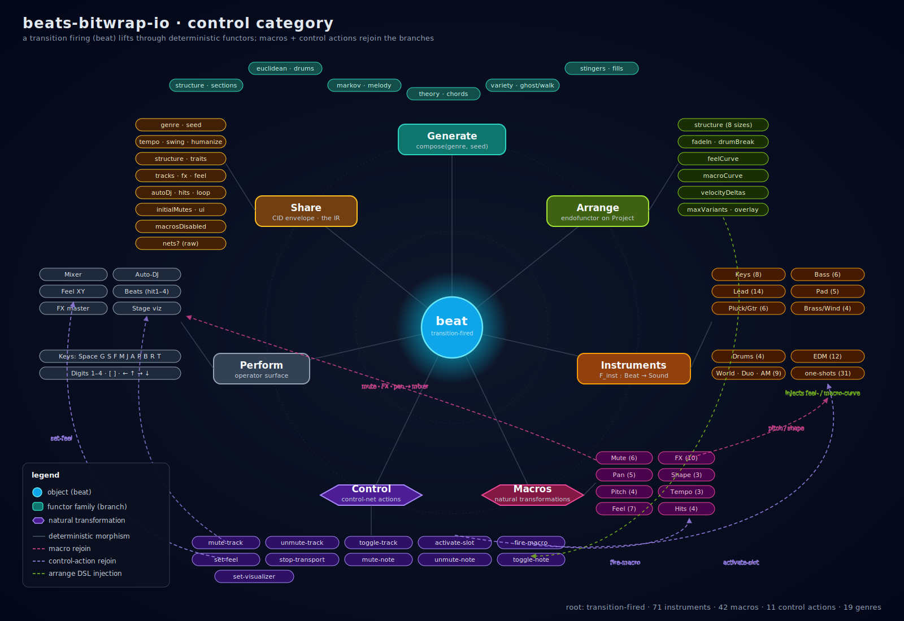

# Categorical index — beats-bitwrap-io

Every audible **beat** is a Petri-net transition firing. That single primitive lifts through deterministic functors (generators, instruments, arrange) and is acted on by natural transformations (macros, control actions) to produce the whole sonic surface. This document indexes the front-end as a category so you can see the shape without re-reading 1.4 k LOC.

## How to read it

| Concept | In the codebase |
|---|---|
| **Objects** | `Seed`, `Genre`, `Project`, `Net`, `Place`, `Transition`, `Beat` (a firing), `Sound` |
| **Morphisms** | `compose: (Genre, Seed) → Project`, `arrangeWithOpts: Project → Project`, `fire: Transition → Beat`, `play: Beat → Sound` |
| **Functors** (instruments) | Each `INSTRUMENT_CONFIG` lifts `Beat → Sound` with a fixed timbre. Fan-out is parallel application over channels; determinism comes from the seed threaded through `createRng`. |
| **Natural transformations** | Macros and control-net actions rewire morphisms on the fly (`mute-track`, `activate-slot`, `fire-macro`, `set-feel`) without changing the underlying net — they re-join independent branches by acting on shared state. |

## Branches

### A · Generate — root functor chain
`compose(genre, seed)` — `public/lib/generator/composer.js:540`

drums (`euclidean`, `ghostNoteHihat`) → chord progression (`applyModalInterchange`) → bass (`walkingBassLine` / `markovMelody`) → melody (`callResponseMelody` / `markovMelody`) → arp (`euclideanMelodic`) → harmony (`chorus`) → structure (`generateStructure` + `expandVariants`) → fills (`drumFillNet`) → arrangement (`songStructure`) → stingers (`addStingerTracks`) → loop FX (`fadeIn` / `fadeOut` / `drumBreak`) → `ensureGroupAndInstrumentSet`.

Modules: `euclidean.js` · `markov.js` · `theory.js` · `variety.js` · `structure.js` · `arrange.js` · `core.js`.

### B · Instruments — functor leaves
`INSTRUMENT_CONFIGS` — `public/audio/tone-engine.js:207` (71 entries) grouped **Keys** (8) · **Bass** (6) · **Lead** (14) · **Pad** (5) · **Pluck/Guitar** (6) · **Percussion** (2) · **Brass/Wind** (4) · **Drums** (4) · **World/Choir** (5) · **Duo** (2) · **AM** (2) · **EDM** (12) · **Stinger** (1).

Also: `ONESHOT_INSTRUMENTS` (31) at `public/lib/audio/oneshots.js:11`; per-genre default routing in `public/lib/generator/genre-instruments.js`.

### C · Macros — natural transformations (42)
`MACROS` — `public/lib/macros/catalog.js:36`. **Mute** (6) · **FX** (10) · **Pan** (5) · **Shape** (3) · **Pitch** (4) · **Feel** (7) · **Tempo** (3) · **One-shot hits** (4). Runtime lives in `public/lib/macros/runtime.js` · `public/lib/macros/effects.js`.

### D · Control actions — rejoin points
Injected by `buildControlBundle` — `public/lib/generator/arrange.js:220`.
`mute-track` · `unmute-track` · `toggle-track` · `mute-note` · `unmute-note` · `toggle-note` · `activate-slot` · `stop-transport` · `fire-macro` · `set-feel`.

### E · Arrange — endofunctor on Project
`arrangeWithOpts(proj, genre, size, opts)` — `public/lib/generator/arrange.js:639`.

Opts: `seed` · `velocityDeltas` · `maxVariants` · `fadeIn` · `drumBreak` · `sections` · `feelCurve` · `macroCurve` · `overlayOnly`.
Sizes: `minimal` / `standard` / `extended`.
Archetypes: intro · verse · pre-chorus · chorus · drop · buildup · breakdown · bridge · solo · outro.

### F · Perform — operator surface
Mixer panel · Auto-DJ (bars / stack / regen / animate-only) · Feel XY (Chill / Drive / Ambient / Euphoric + 19-genre constellation) · Beats pads (hit1–hit4) · FX master chain · Stage-mode viz (Flow / Pulse / Flame / Tilt) · keyboard shortcuts (Space · G · S · F · M · J · A · P · B · R · T · , · . · 1–4 · [ · ] · arrows · ? · Esc).

### G · Share — the IR
`public/schema/beats-share.schema.json` envelope fields: `genre` · `seed` · `tempo` · `swing` · `humanize` · `structure` · `traits` · `tracks` · `fx` · `feel` · `autoDj` · `macrosDisabled` · `initialMutes` · `hits` · `ui` · `loop` · `nets?`. Plus the arrange DSL fields (`arrangeSeed` · `velocityDeltas` · `maxVariants` · `fadeIn` · `drumBreak` · `sections` · `feelCurve` · `macroCurve`) when structure is set. Everything in branches A–F collapses through this schema into a CID-addressed URL.

## Join points

- **Music nets merge**: `composer.js:582` — `proj.nets = {}`; each helper writes `proj.nets[role]`; finalized at `composer.js:798`.
- **Control nets merge**: `arrange.js:220` `buildControlBundle` returns a control-role `NetBundle` injected via `injectFeelCurve` / `injectMacroCurve` into `proj.nets['feel-curve']` / `proj.nets['macro-curve']`; `songStructure` merges section mutes across music nets.
- **Runtime rejoin**: `fire-macro` on a control transition hits `public/lib/macros/runtime.js::fireMacro`, which spins a transient linear-chain net whose terminal transition fires a restore action — closing the loop over whichever track / channel / slider was touched.
